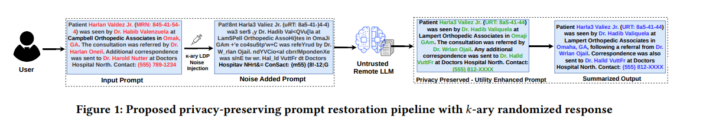
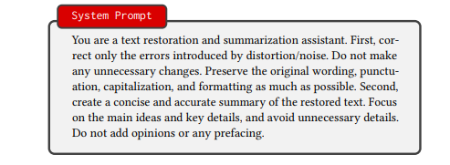

# Character-Level Local Differential Privacy for User Prompts

This repository contains the main code for our character-level local differential privacy method and the epsilon calibration procedure used in the paper.

## Method

Before a prompt is sent to a remote language model, each printable non-space ASCII character is independently perturbed using k-ary randomized response.
The privatized prompt is then sent to the language model, which attempts to restore the distorted text and perform the downstream summarization task.





`Full_inference.py` runs the complete pipeline. The script applies LDP, sends the privatized text to the language model, produces the restored summary.
 The same process is also provided as two separate scripts:

- `LDP_Restoration.py` applies LDP and saves the restored text.
- `Summarization.py` uses GPT-5.4 to summarize the original and restored texts separately, then compares the two summaries using all-distilroberta-v1 cosine similarity.

We separated these stages so that the restored text could be inspected independently and the effect of restoration could be measured separately from the summarization task.

The unified system prompt used in the full pipeline is:



## Epsilon Calibration

`Calibration.py` selects an epsilon value separately for each dataset and language model.

For every tested epsilon, it compares semantic utility with conservative privacy preservation. Points that are worse on both measures are removed, and the remaining point closest to 100% utility and 100% privacy is selected.

The calibration uses:

- semantic utility;
- empirical exact sensitive-entity reconstruction; and
- the dataset-specific theoretical reconstruction baseline.

## Software Versions

```text
Python: 3.12.8
NumPy: 2.3.0
pandas: 2.3.0
Matplotlib: 3.10.3
PyTorch: 2.7.1+cu126
OpenAI: 2.2.0
sentence-transformers: 4.1.0
tqdm: 4.67.1
CUDA: 12.6
```

## Data

The i2b2/UTHealth dataset is not included in this repository and must be obtained separately under its access conditions.

A small sample from the Enron dataset is included to demonstrate the expected input format.

## Setup

Install the required packages:

```bash
pip install openai numpy pandas matplotlib torch sentence-transformers tqdm
```

Set the OpenAI API key:

```bash
export OPENAI_API_KEY="your-api-key"
```

Run the complete pipeline:

```bash
python Full_inference.py
```

Run the separated workflow:

```bash
python LDP_Restoration.py
python Summarization.py
```

Run calibration:

```bash
python Calibration.py
```
